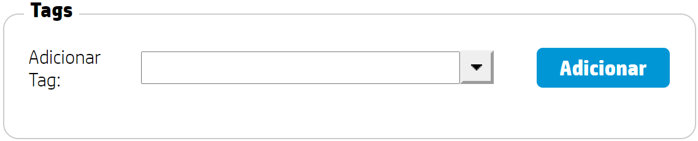
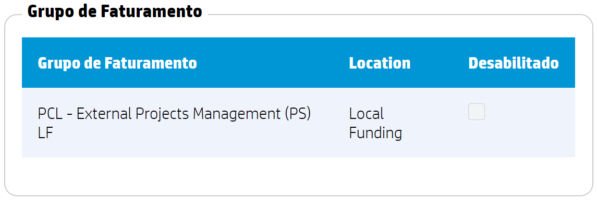
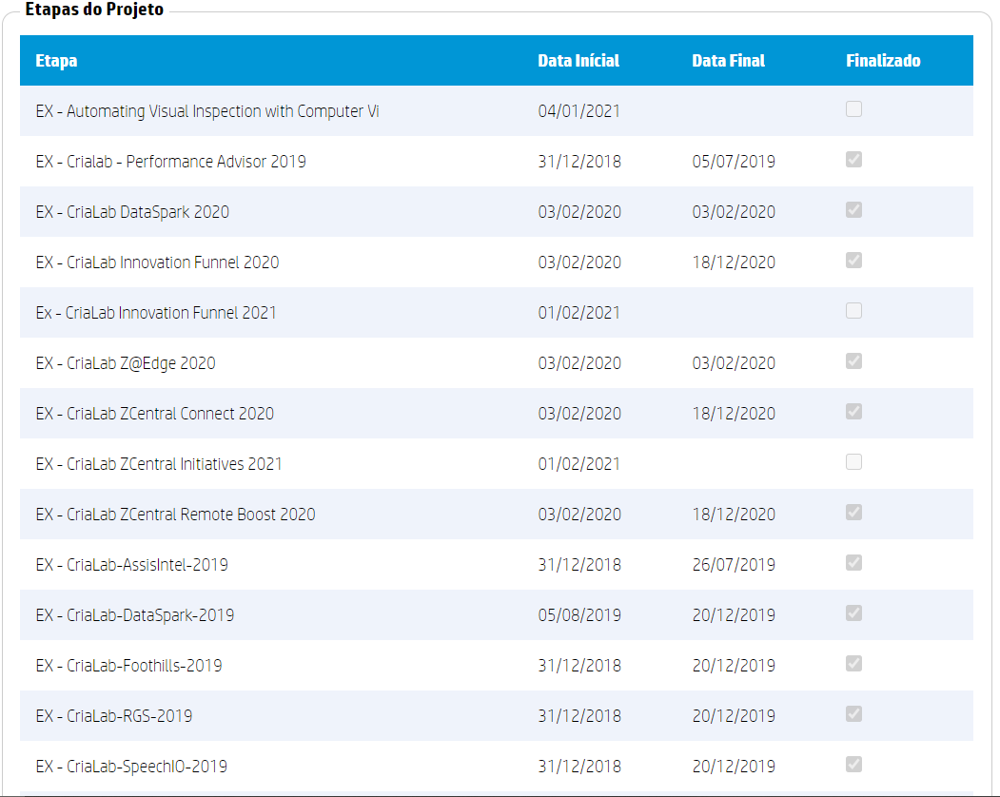
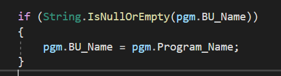
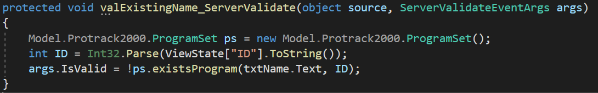
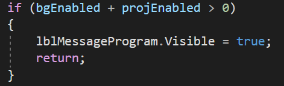
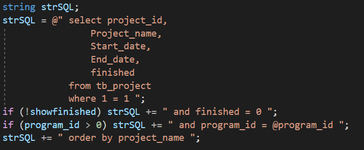
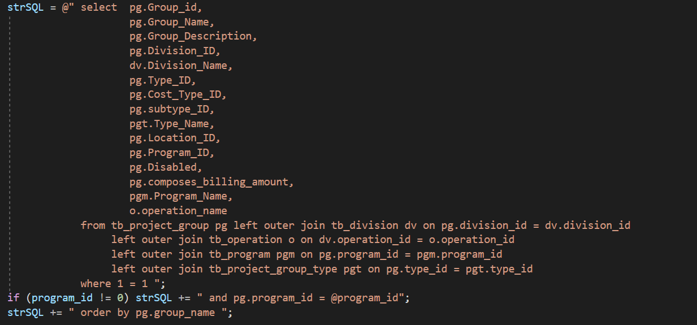

#**Program** ###**End points**

---

- View/Program/Create.aspx

###**Relacionamentos**

---

- Possui relacionamento direto com a entidade tag

_Tag_

- Possui relacionamento indireto com a entidade Grupo de faturamento(tb_project_group) e a entidade Etapas do projeto(tb_project)

_Grupo de faturamento_

_Etapas do projeto_

###**Estrutura de dados**

---

**tb_Program**
Entidade | Tipo | Tamanho | Chave primaria | Chave estrangeira | Nulo
-------- | ---- | ------- | -------------- | ----------------- | ----
Program_ID | INT | - | Sim | Não | Não
Program_Name | VARCHAR | 50 | Não | Não | Não
Program_Description | VARCHAR | 800 | Não | Não | Sim
Operation_ID | INT | - | Não | Sim | Sim
Disabled | INT | - | Não | Não | Sim
BusinessUnit_ID | INT | - | Não | Sim | Sim
Portfolio_Manager_ID | INT | - | Não | Sim | Sim
Program_Type_ID | INT | - | Não | Sim | Sim
Product_Stage_ID | INT | - | Não | Sim | Sim
Funding_Investment_ID| INT | - | Não | Sim | Sim
BusinessFocusArea | Varchar | 150 | Não | Não | Sim
Program_Cost_Type_ID | INT | - | Não | Sim | Sim
ObjetivoGeral | Varchar | Max | Não | Não | Sim
ProblemaTecnico | Varchar | Max | Não | Não | Sim
Program_Alcance_ID | INT | - | Não | Sim | Sim
Program_Nivel_ID | INT | - | Não | Sim | Sim
BU_Name | Varchar | 50 | Não | Não | Sim

**tb_tag**
Entidade | Tipo | Tamanho | Chave primaria | Chave estrangeira | Nulo
-------- | ---- | ------- | -------------- | ----------------- | ----
ID | INT | - | Sim | Não | Não
Class_ID | INT | - | Não | Sim | Não
Name | VARCHAR | 50 | Não | Não | Não

**Obs.:** Verifique se os dados são inseridos ou cadastrados.

**tb_tag_class**
Entidade | Tipo | Tamanho | Chave primaria | Chave estrangeira | Nulo
-------- | ---- | ------- | -------------- | ----------------- | ----
ID | INT | - | Sim | Não | Não
Name | VARCHAR | 50 | Não | Não | Não

**Obs.:** Verifique se os dados são inseridos ou cadastrados.

**tb_tag_program**
Entidade | Tipo | Tamanho | Chave primaria | Chave estrangeira | Nulo
-------- | ---- | ------- | -------------- | ----------------- | ----
tag_ID | INT | - | Não | Sim | Não
program_ID | INT | - | Não | Sim | Não

**Obs.:** Verificar se a dependência está sendo usada pela aplicação, por que hoje não tinha nenhuma tag cadastrada.

###**Regras de negócio**

---

**Create**

_Campo Bu.Name deve ser preenchido com o nome do programa quando este for vazio._

**Edit**
**OBS.:** Verificar se a regra que impossibilita o cadastro de um programa com o mesmo nome é utilizada.

- Quando o programa possuir projetos e grupo de faturamento não deve ser possivel desabilitar o mesmo.

_É mostrado as etapas referente ao programa._

_É mostrado os grupos de faturamento referente a programa._

**Delete**

- Não deve permitir deletar um programa que esteja sendo usado.
